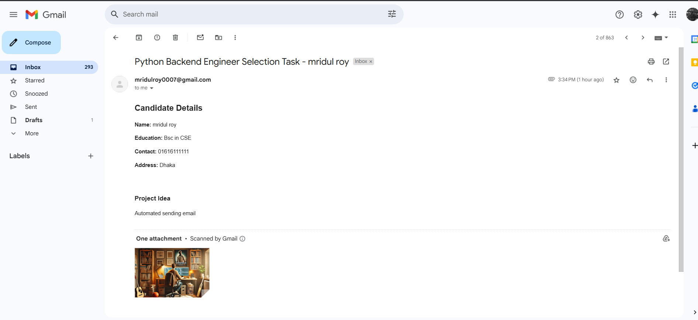

# Multipart-Email-API-with-Multiple-Recipients-Embedded-Image

# Django Email Selection Task

This API sends a styled HTML email with an embedded image to allowed recipients.

---

## 📦 Setup Instructions

Clone or unzip this project:
   ```bash
   git clone https://github.com/mridul-roy/Multipart-Email-API-with-Multiple-Recipients-Embedded-Image  # OR unzip
   cd emailproject

Create a virtual environment and activate:

    pipenv shell
    pipenv install django

Install dependencies:
    pip install -r requirements.txt

Setup SMTP (for me gmail) App password athintication and add on 
Create a .env file:

    EMAIL_HOST_USER=your_email@gmail.com
    EMAIL_HOST_PASSWORD=your_app_password

Run the server:
    python manage.py runserver


Test the API with Postman:

POST http://localhost:8000/api/send-selection-email/

## 📸 Email Delivery Screenshot

Below is the proof of email delivery:



